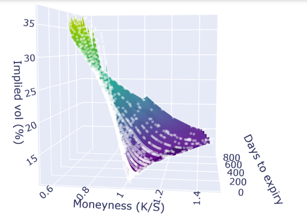
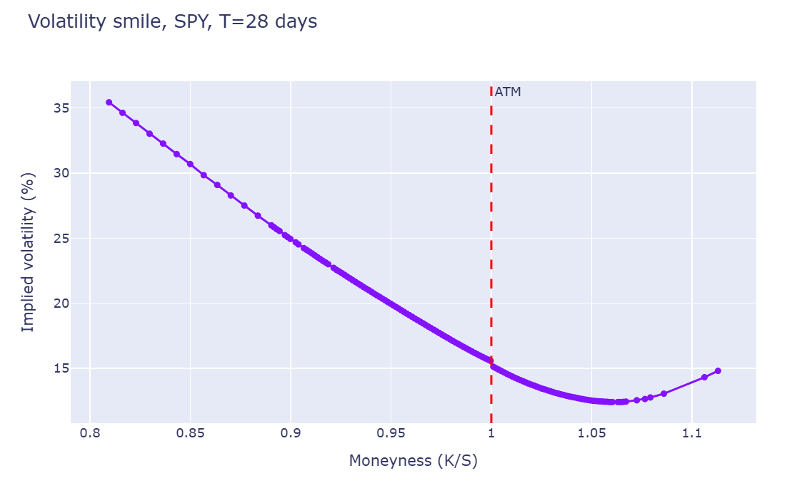
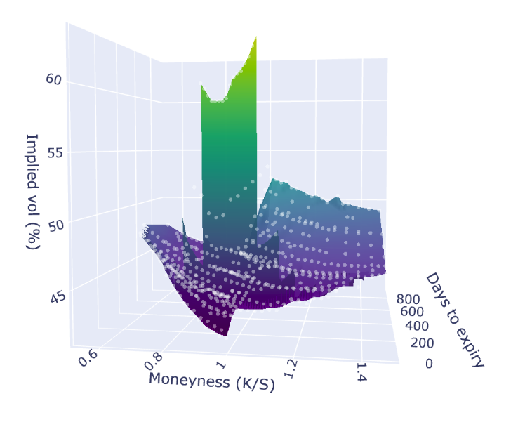

# option_pricing_lab

A from-scratch Black-Scholes implementation with double-validated Greeks, a Newton-Raphson implied volatility solver, and a live volatility surface pipeline that ingests real options data from any liquid US ticker.

Built to deeply understand options pricing mechanics rather than to import a library.

---

## Demo

**SPY** — the canonical equity surface. Clean skew (OTM puts richer than OTM calls), smile flattens with time-to-expiry, smooth term structure across maturities.



*Classic equity skew: OTM puts (left wing) trade richer than OTM calls (right wing), reflecting demand for downside protection. Smile flattens as time-to-expiry grows.*


*28-day option volatility smile - note linear continuity, density of solved contracts around ATM, and the reinforcement of the convention that high protective-put demand inflates high OTM implied vol.*

**NVDA** — same code, same trading day. The spike at short-dated ATM strikes is the market pricing the earnings call on the night I'm writing. Once you get past the post-earnings expirations, the surface settles to normal levels.



*Note vol spike in N and ATM low TTM options, indicative of high event-vol around tonight's earnings call. Demonstrates model adaptability in representation of vol structures.*


Index ETFs produce smooth surfaces; single-names near events produce sharp event-vol concentrations. The code reveals the structure correctly without any special handling.

---

## What's inside

```
option_pricing_lab/
├── Options_Pricing_Lab.ipynb     # the full pipeline, end-to-end
├── images/                        # rendered surface screenshots
├── requirements.txt
└── README.md
```

The notebook is structured top-to-bottom in dependency order:

1. **Pricing** — closed-form Black-Scholes for European calls and puts with continuous dividend yield (Merton extension).
2. **Greeks (analytical)** — Delta, Gamma, Vega, Theta, Rho for both calls and puts, derived from first principles.
3. **Greeks (finite-difference validation)** — every Greek computed a second way via numerical perturbation. Used as independent validation; agrees with the analytical formulas to ~5+ decimals.
4. **Implied volatility solver** — Newton-Raphson iteration using vega as the derivative. Tolerance `1e-8`, typically converges in 4-6 iterations.
5. **Data layer** — Yahoo Finance options chain fetcher, Treasury yield curve construction with per-maturity rate interpolation, dividend yield estimation.
6. **Filtering** — keeps only OTM options (calls with K ≥ S, puts with K ≤ S), drops illiquid quotes, applies a minimum volume / open interest / bid-ask spread cutoff.
7. **Surface rendering** — interpolates the (moneyness, days-to-expiry, IV) point cloud onto a regular grid via `scipy.griddata`, renders interactively with plotly.

---

## Math

### Black-Scholes with dividends

For a European call on an underlying paying continuous dividend yield $q$:

$$C = S e^{-qT} N(d_1) - K e^{-rT} N(d_2)$$

$$d_1 = \frac{\ln(S/K) + (r - q + \tfrac{1}{2}\sigma^2)T}{\sigma\sqrt{T}}, \qquad d_2 = d_1 - \sigma\sqrt{T}$$

Put price by symmetry (or directly from the PDE):

$$P = K e^{-rT} N(-d_2) - S e^{-qT} N(-d_1)$$

### Greeks

All five Greeks come from differentiating the price formula with respect to one input at a time. The derivations have a recurring pattern: the chain rule produces terms in both $\phi(d_1)$ and $\phi(d_2)$, and the identity

$$S e^{-qT} \phi(d_1) = K e^{-rT} \phi(d_2)$$

collapses them. Without this identity, every Greek would be a messy multi-term expression. With it, most reduce to a single clean formula.

| Greek | Call | Put |
|---|---|---|
| Delta | $e^{-qT} N(d_1)$ | $-e^{-qT} N(-d_1)$ |
| Gamma | $\frac{e^{-qT}\phi(d_1)}{S\sigma\sqrt{T}}$ | same |
| Vega | $S e^{-qT} \phi(d_1) \sqrt{T}$ | same |
| Rho | $T K e^{-rT} N(d_2)$ | $-T K e^{-rT} N(-d_2)$ |
| Theta | $-\frac{S e^{-qT} \phi(d_1) \sigma}{2\sqrt{T}} - rKe^{-rT}N(d_2) + qSe^{-qT}N(d_1)$ | $-\frac{S e^{-qT} \phi(d_1) \sigma}{2\sqrt{T}} + rKe^{-rT}N(-d_2) - qSe^{-qT}N(-d_1)$ |

Gamma and vega are identical between calls and puts (intuitive: convexity to spot and sensitivity to vol don't care about the call/put distinction). Delta differs by exactly 1 in magnitude, a consequence of put-call parity.

### Why finite-difference validation

Closed-form Greeks are derived analytically — easy to introduce a sign error or drop a factor and produce a formula that *happens* to be correct at one input but wrong elsewhere. Hand-verifying against one textbook number is not enough.

Finite-difference Greeks compute the same quantity by directly perturbing the input and measuring the price change:

$$\Delta_{\text{fd}} = \frac{C(S+\epsilon) - C(S-\epsilon)}{2\epsilon}$$

The two methods share no code path beyond the pricing function itself, so when they agree to 6+ decimals across diverse inputs, both are trustworthy.

### Implied volatility

The market gives you the price. You want the σ that produces it. There's no closed-form inverse, so we use Newton-Raphson:

$$\sigma_{n+1} = \sigma_n - \frac{\text{BS}(\sigma_n) - \text{market}}{\nu(\sigma_n)}$$

Where vega serves as the derivative. Converges quadratically when well-behaved. Edge cases handled by exception catching and post-hoc filtering: a solver that returns negative or absurd σ is treated as a failure and discarded.

### Per-maturity risk-free rates

A single short rate applied to all maturities introduces bias for longer-dated options. The notebook fetches four points on the Treasury curve (3M, 5Y, 10Y, 30Y) and linearly interpolates to each option's specific time-to-expiry. For SPY-style chains spanning 1 month to 2+ years, this matters in the 30-100 basis point range — small per-option but visible in the long-dated wings of the surface.

### Why OTM-only

In-the-money options have most of their value in intrinsic. Vega is tiny relative to mid-price, so small price errors translate to huge IV errors. The standard quant practice is to compute IVs only from OTM options (calls with K ≥ S, puts with K ≤ S), then use put-call parity if you ever need the ITM equivalent. The notebook applies this filter, which approximately halves the option count and dramatically reduces noise in the surface wings.

---

## Validation results

All eight Greeks computed analytically agree with their finite-difference equivalents to **>5 decimal places** across a wide range of inputs spanning moneyness 0.5-2.0, time-to-expiry 0.01-2.0 years, vol 0.10-0.60, and rate 0.01-0.10.

Implied vol round-trip — given any input (S, K, T, r, σ, q), price the option, then solve for IV from the price — recovers the original σ to within `1e-7` across the same input range.

On live SPY data: 2,400+ options after filtering, ~90% converge to a valid IV across 30 trials. Failures are deep-wing options with tiny vega, where IV from a single mid-price is genuinely ill-defined.

---

## Running it

```bash
python -m venv .venv
.venv\Scripts\activate     # Windows
# source .venv/bin/activate  # Mac/Linux
pip install -r requirements.txt
jupyter notebook Options_Pricing_Lab.ipynb
```

In the second-to-last cell, change the ticker:

```python
TICKER = "SPY"   # or QQQ, AAPL, TSLA, NVDA, GLD, ...
df, q, spot = build_surface(TICKER)
render_surface(df, TICKER, spot)
```
Run the final cell to see a simpler vol smile plot at a single TTM (fungible in earlier cell). 

Run takes about 30-60 seconds per ticker, dominated by Yahoo Finance API latency and the IV solver running across hundreds of options.

---

## Known simplifications

- **European pricing applied to American-style options.** SPY and most listed equity options are American (early-exercise possible). For non-dividend-paying or low-dividend underlyings, the early-exercise premium is negligible. For deep-ITM options on high-yielders it matters; those are filtered out by the OTM-only rule anyway.
- **Continuous dividend yield approximation.** Real dividends are discrete events on specific ex-dates. The continuous-yield approximation is fine for index ETFs but degrades for high-payout single names.
- **Linear yield curve interpolation.** Strictly, the right interpolation is on zero-coupon yields derived from bootstrapped Treasury prices, not directly on the quoted par yields. The error is 10-20 bps for the maturities we care about.
- **Yahoo Finance options data.** Bid-ask spreads can be stale outside trading hours; volume reflects today's flow only.

---

## What this isn't

This isn't a trading system. There's no alpha here. The vol surface is a *picture of what the market believes*, not a prediction of where it should be. A trading system built on this would need: a richer pricing model (Heston or SABR for stochastic vol), event-aware vol decomposition, market-making logic, and execution. Those are the natural next pieces but out of scope for a learning project.

---

## References

- Hull, *Options, Futures, and Other Derivatives* (11th ed.), Ch. 13–15
- Black, F. & Scholes, M. (1973). *The Pricing of Options and Corporate Liabilities*. Journal of Political Economy.
- Merton, R. (1973). *Theory of Rational Option Pricing*. Bell Journal of Economics.
